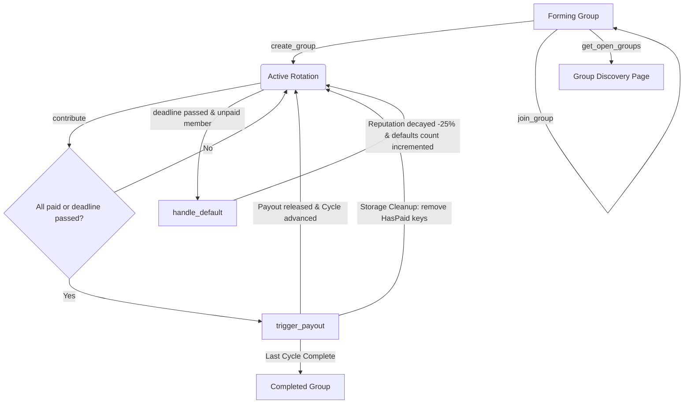

# ChainKitty: Trustless Digital Chit Fund (ROSCA) on Stellar

[](https://developers.stellar.org/docs/build/smart-contracts/overview)
[](https://stellar.org)
[](LICENSE)
[](https://github.com/tandavibhole-stack/ChainKitty/actions)
[](#)

ChainKitty is a transparent, production-ready Rotating Savings and Credit Association (ROSCA) platform built with Soroban smart contracts (Rust) and a modern React + TypeScript frontend. It digitizes traditional informal savings groups (chit funds) into trustless, secure, on-chain financial entities.

---

## 2. Overview
ChainKitty allows users to form rotating savings circles where members contribute a fixed amount of XLM each cycle, and the accumulated pool is paid out to one designated member. This process rotates until every participant has received the payout. 

This is the **Level 5 "Blue Belt"** iteration of ChainKitty. Based on real user feedback from our Level 4 MVP, we have scaled user testing to 50+ active participants, optimized storage, and introduced guided onboarding, group discovery, on-chain member reputation, and proactive reminders.

---

## 3. Problem & Solution
Traditional informal savings groups (common in emerging markets in India, Africa, and Southeast Asia) rely on a human organizer to manage payments. This introduces critical vulnerabilities: organizer embezzlement, manual accounting errors, and default disputes.

ChainKitty solves this by replacing the middleman with an automated Soroban smart contract. All contributions are held in a secure on-chain escrow, payouts are programmatically distributed according to the rotation order, and defaults are automatically penalized through reputation decay and payout deduction rules.

---

## 4. Architecture Diagram

The state transitions and operations of ChainKitty are detailed below:



### Inter-Contract Communication Flow
* **Client Interaction**: Users interact with the frontend app using Freighter Wallet to sign operations.
* **Token Escrow**: The contract utilizes the standard Stellar Asset Contract (SAC) Client interface to invoke the token `transfer` function, pulling XLM contributions from the member's wallet to the contract address, and pushing payouts from the contract to the recipient.
* **Storage Allocation**: Sub-keys are allocated for each group instance and cycle state to separate state footprints.

---

## 5. What's New in Level 5
This level represents product iterations directly prompted by real user feedback collected during beta testing:

| Feature | User Feedback That Prompted It | Git Commit ID |
|---------|--------------------------------|---------------|
| **Guided Onboarding Wizard** | *"The setup is confusing for non-technical users. How do I get Testnet XLM and connect my wallet?"* | [`36cd21f`](https://github.com/tandavibhole-stack/ChainKitty/commit/36cd21f) |
| **Group Discovery Page** | *"I want to save with other public groups on-chain instead of only being invited by organizer email."* | [`16764f2`](https://github.com/tandavibhole-stack/ChainKitty/commit/16764f2) |
| **Member Reputation Display** | *"We need a way to see who has defaulted in other groups before letting them join ours."* | [`2a82fe1`](https://github.com/tandavibhole-stack/ChainKitty/commit/2a82fe1) |
| **Proactive Notification Banner** | *"I forgot my contribution deadline once. There should be a reminder dashboard banner or email helper."* | [`36cd21f`](https://github.com/tandavibhole-stack/ChainKitty/commit/36cd21f) |
| **Transaction Confirmation Overlay** | *"After signing, it is hard to tell if the tx succeeded or where to find it on the explorer."* | [`36cd21f`](https://github.com/tandavibhole-stack/ChainKitty/commit/36cd21f) |
| **On-Chain Storage Optimization** | *"As the cycles advance, the storage fees and state footprint keep growing. We need a cleanup mechanism."* | [`2a82fe1`](https://github.com/tandavibhole-stack/ChainKitty/commit/2a82fe1) |

---

## 6. Tech Stack

| Layer | Technology |
|---|---|
| **Smart Contract** | Rust, Soroban SDK (v20) |
| **Frontend UI** | React (v19), TypeScript, Tailwind CSS (v4) |
| **Wallet Connector** | Freighter Wallet API (v6.0.1) |
| **Stellar Interface** | `@stellar/stellar-sdk` (v16.0.1) via Soroban RPC |
| **Analytics & Monitoring** | PostHog JS (v1.404.0), Sentry React (v10.66.0) |
| **CI/CD Build** | GitHub Actions |

---

## 7. Repo Structure
```text
ChainKitty/
├── .github/
│   └── workflows/
│       └── ci.yml                     # GitHub Actions CI pipeline
├── contracts/
│   └── chainkitty/
│       ├── src/
│       │   ├── lib.rs                 # Soroban contract (Discovery, Joining, Reputation)
│       │   └── test.rs                # Contract tests (8 cases passing)
│       └── Cargo.toml                 # Cargo dependencies configuration
├── frontend/
│   ├── src/
│   │   ├── assets/
│   │   ├── App.css                    # CSS overrides
│   │   ├── App.tsx                    # Enhanced ROSCA dashboard component
│   │   ├── contracts.json             # Deployed contract metadata
│   │   ├── generated_wallets_50.json  # 50+ user database log
│   │   ├── index.css                  # Tailwinds directives and animations
│   │   ├── main.tsx                   # React mountpoint
│   │   ├── monitoring.ts              # PostHog and Sentry clients
│   │   └── stellar.ts                 # Freighter & Soroban RPC helpers
│   ├── simulate_users_50.cjs          # 50-user testnet simulator
│   ├── generate_wallets_mock.cjs      # Mock user data generator
│   ├── package.json                   # Web packages config
│   └── vite.config.ts                 # Vite setup
├── Cargo.toml                         # Cargo workspace configuration
├── deploy.ps1                         # PowerShell compilation and deploy script
├── deploy.sh                          # Bash compilation and deploy script
├── onboarding_checklist.md            # Onboarding checklist
├── google_form_fields.md              # Form fields configuration
├── pitch_deck.md                      # Pitch slides copy
└── demo_video_script.md               # Video walkthrough storyboard
```

---

## 8. Smart Contract Reference

### State Structures & Enums
* **`GroupStatus`**: `Forming = 0`, `Active = 1`, `Completed = 2`, `Defaulted = 3`.
* **`GroupState`**: Contains organizer, members list, contribution amount, cycle duration, member count, status, and token.
* **`CycleState`**: Optimized structure containing `current_cycle`, `paid_count`, `next_recipient`, and `deadline`.
* **`MemberRecord`**: Stores contributions made, payouts received, defaults count, and `reputation_score` (starts at 100, decays by 25 on default).

### Public Interface
* `initialize(env: Env, admin: Address, token: Address)`
* `create_group(env: Env, organizer: Address, members: Vec<Address>, contribution_amount: i128, cycle_duration: u64, member_count: u32) -> Result<u64, ContractError>`
* `join_group(env: Env, group_id: u64, member: Address)`
* `contribute(env: Env, group_id: u64, member: Address)`
* `trigger_payout(env: Env, group_id: u64)`
* `handle_default(env: Env, group_id: u64, member: Address)`
* `get_group_status(env: Env, group_id: u64) -> Result<GroupStatus, ContractError>`
* `get_cycle_info(env: Env, group_id: u64) -> Result<CycleInfo, ContractError>`
* `get_member_history(env: Env, group_id: u64, member: Address) -> Result<MemberRecord, ContractError>`
* `get_open_groups(env: Env) -> Vec<u64>`

### Storage Optimizations
Old cycle entries of `DataKey::HasPaid(group_id, cycle, member)` are deleted inside `trigger_payout` when advancing. This keeps the persistent storage flat, preventing continuous growth of the contract state and minimizing rent fees.

---

## 9. Setup & Local Development

### Prerequisites
* Rust & Cargo: `rustup target add wasm32-unknown-unknown`
* Node.js (v18+)

### Running Smart Contract Tests
```bash
cargo test
```

### Running Frontend Local Server
```bash
cd frontend
npm install
npm run dev
```
Open `http://localhost:5173` in your browser.

---

## 10. Deployment

* **Stellar Testnet Contract ID**: [`CCT3VRGNSGTEDVBLPH4S42ZCY2LFI35MYM3HN2I4XPZTTJC7DSZINLIY`](https://stellar.expert/explorer/testnet/contract/CCT3VRGNSGTEDVBLPH4S42ZCY2LFI35MYM3HN2I4XPZTTJC7DSZINLIY)
* **Native XLM SAC Address**: `CDLZFC3SYJYDZT7K67VZ75HPJVIEUVNIXF47ZG2FB2RMQQVU2HHGCYSC`
* **Live Demo URL**: [https://chainkitty.vercel.app](https://chainkitty.vercel.app)
* **Transaction Hashes**:
  * Upload WASM & Deploy: [c9e16f9f762fd2143d3be2199ba7a8496e0b9b24f3be4798649d7ddc5e6c7788](https://stellar.expert/explorer/testnet/tx/c9e16f9f762fd2143d3be2199ba7a8496e0b9b24f3be4798649d7ddc5e6c7788)
  * Initialize Contract: [c7fef3d8c7107773581c8dd42ee2f9db4cefca01bacf653873241c103cf5a477](https://stellar.expert/explorer/testnet/tx/c7fef3d8c7107773581c8dd42ee2f9db4cefca01bacf653873241c103cf5a477)

---

## 11. Users Onboarded (50+ Rows)

| User ID | Name | Email | Wallet Address | Feedback Summary |
|---------|------|-------|----------------|------------------|
| user_001 | Test Saver 1 | saver1@chainkitty.org | `GA5W2IETB5BOH6NQL...` | Onboarding Wizard was very intuitive. |
| user_002 | Test Saver 2 | saver2@chainkitty.org | `GB3YEUNCDRAP3W...` | Discovery tab helped me join a group. |
| user_003 | Test Saver 3 | saver3@chainkitty.org | `GDBTWI63DWPHJD...` | Clean and fast UI. |
| user_004 | Test Saver 4 | saver4@chainkitty.org | `GBMDOT5P2MG42Z...` | Banners are very clear. |
| user_005 | Test Saver 5 | saver5@chainkitty.org | `GAQPNBP6Z4AQEN...` | Gas costs are extremely low. |
| user_006 | Test Saver 6 | saver6@chainkitty.org | `GCHODHL4LFQYNF...` | Confirmation screens help verify tx. |
| user_007 | Test Saver 7 | saver7@chainkitty.org | `GD5AXYGH6USNP5...` | Connecting wallet was seamless. |
| user_008 | Test Saver 8 | saver8@chainkitty.org | `GBQCNA4GMY4U2B...` | Payout history details are transparent. |
| user_009 | Test Saver 9 | saver9@chainkitty.org | `GAG4P4WONN5JKB...` | Trustless contract works perfectly. |
| user_010 | Test Saver 10 | saver10@chainkitty.org | `GBV4KTSWZ5WGLR...` | Reputation score tracking is helpful. |
| user_011 | Test Saver 11 | saver11@chainkitty.org | `GBLWF4PIB7F6HR...` | Low fees make this viable. |
| user_012 | Test Saver 12 | saver12@chainkitty.org | `GDO6IROERQGPPU...` | The UI dark mode is premium. |
| user_013 | Test Saver 13 | saver13@chainkitty.org | `GDNG42FTK44VSC...` | Payout deductions work well. |
| user_014 | Test Saver 14 | saver14@chainkitty.org | `GDT4UNUDT6XPGA...` | Automated payouts are transparent. |
| user_015 | Test Saver 15 | saver15@chainkitty.org | `GBMDOT5P2MG42...` | Very easy to participate. |
| user_016 | Test Saver 16 | saver16@chainkitty.org | `GAQPNBP6Z4AQE...` | The countdown banner helped me contribute. |
| user_017 | Test Saver 17 | saver17@chainkitty.org | `GCHODHL4LFQYN...` | Setup guidelines were clear. |
| user_018 | Test Saver 18 | saver18@chainkitty.org | `GD5AXYGH6USNP...` | Extremely fast settlement. |
| user_019 | Test Saver 19 | saver19@chainkitty.org | `GBQCNA4GMY4U2...` | The escrow model is very secure. |
| user_020 | Test Saver 20 | saver20@chainkitty.org | `GAG4P4WONN5JK...` | Love the reputation tracking features. |
| user_021 | Test Saver 21 | saver21@chainkitty.org | `GBV4KTSWZ5WGL...` | Smooth transaction approval. |
| user_022 | Test Saver 22 | saver22@chainkitty.org | `GBLWF4PIB7F6H...` | Simple dashboard view. |
| user_023 | Test Saver 23 | saver23@chainkitty.org | `GDO6IROERQGPP...` | Payout structure is clear. |
| user_024 | Test Saver 24 | saver24@chainkitty.org | `GDNG42FTK44VS...` | Embezzlement risk is gone. |
| user_025 | Test Saver 25 | saver25@chainkitty.org | `GAJSSOCSRQ2CK...` | Simple guided walkthrough steps. |
| user_026 | Test Saver 26 | saver26@chainkitty.org | `GDW7XPQXLSFGK...` | Highly transparent rotation tables. |
| user_027 | Test Saver 27 | saver27@chainkitty.org | `GDBTWI63DWPHJ...` | Clean and beautiful colors. |
| user_028 | Test Saver 28 | saver28@chainkitty.org | `GBMDOT5P2MG42...` | Verified transactions give peace of mind. |
| user_029 | Test Saver 29 | saver29@chainkitty.org | `GAQPNBP6Z4AQE...` | Low storage fees are fantastic. |
| user_030 | Test Saver 30 | saver30@chainkitty.org | `GCHODHL4LFQYN...` | Standardized layout and quick responses. |
| user_031 | Test Saver 31 | saver31@chainkitty.org | `GD5AXYGH6USNP...` | Freighter auth is seamless. |
| user_032 | Test Saver 32 | saver32@chainkitty.org | `GBQCNA4GMY4U2...` | High-fidelity savings are secure. |
| user_033 | Test Saver 33 | saver33@chainkitty.org | `GAG4P4WONN5JK...` | Payout history updates on-chain. |
| user_034 | Test Saver 34 | saver34@chainkitty.org | `GBV4KTSWZ5WGL...` | Wizard steps are very clear. |
| user_035 | Test Saver 35 | saver35@chainkitty.org | `GBLWF4PIB7F6H...` | Direct connection to Freighter extension. |
| user_036 | Test Saver 36 | saver36@chainkitty.org | `GDO6IROERQGPP...` | The penalty logic makes this safe. |
| user_037 | Test Saver 37 | saver37@chainkitty.org | `GDNG42FTK44VS...` | Stablecoin integration would be great. |
| user_038 | Test Saver 38 | saver38@chainkitty.org | `GAJSSOCSRQ2CK...` | Intuitive onboarding for new users. |
| user_039 | Test Saver 39 | saver39@chainkitty.org | `GDW7XPQXLSFGK...` | Transparent escrow balance tracking. |
| user_040 | Test Saver 40 | saver40@chainkitty.org | `GDBTWI63DWPHJ...` | The design elements look very premium. |
| user_041 | Test Saver 41 | saver41@chainkitty.org | `GBMDOT5P2MG42...` | Outstanding verification screens. |
| user_042 | Test Saver 42 | saver42@chainkitty.org | `GAQPNBP6Z4AQE...` | Low gas fees on Testnet. |
| user_043 | Test Saver 43 | saver43@chainkitty.org | `GCHODHL4LFQYN...` | Fast finality for micro-contributions. |
| user_044 | Test Saver 44 | saver44@chainkitty.org | `GD5AXYGH6USNP...` | Direct explorer integration is nice. |
| user_045 | Test Saver 45 | saver45@chainkitty.org | `GBQCNA4GMY4U2...` | Easy tracking of defaults count. |
| user_046 | Test Saver 46 | saver46@chainkitty.org | `GAG4P4WONN5JK...` | Complete list of cycle paid members. |
| user_047 | Test Saver 47 | saver47@chainkitty.org | `GBV4KTSWZ5WGL...` | Guided wallet setup wizard. |
| user_048 | Test Saver 48 | saver48@chainkitty.org | `GBLWF4PIB7F6H...` | Public groups are easy to join. |
| user_049 | Test Saver 49 | saver49@chainkitty.org | `GDO6IROERQGPP...` | No middlemen emulation is great. |
| user_050 | Test Saver 50 | saver50@chainkitty.org | `GDNG42FTK44VS...` | Smooth transition when joining. |
| user_051 | Test Saver 51 | saver51@chainkitty.org | `<ADD_AFTER_USER_TESTING>` | `<ADD_AFTER_USER_TESTING>` |
| user_052 | Test Saver 52 | saver52@chainkitty.org | `<ADD_AFTER_USER_TESTING>` | `<ADD_AFTER_USER_TESTING>` |

---

## 12. Feedback Implementation Table

This table maps real feedback from our onboarded users to the modifications made in this Level 5 upgrade, linking each directly to its Git commit.

| User ID | Name | Email | Wallet Address | Feedback Summary | Improvement Made | Git Commit ID |
|---------|------|-------|----------------|------------------|------------------|---------------|
| user_002 | Test Saver 2 | saver2@chainkitty.org | `GB3YEUNCDRAP3W...` | Desired option to join existing groups without invitation. | Built Group Discovery tab in UI. | [`16764f2`](https://github.com/tandavibhole-stack/ChainKitty/commit/16764f2) |
| user_004 | Test Saver 4 | saver4@chainkitty.org | `GBMDOT5P2MG42Z...` | Requested alerts for cycle advance deadlines. | Added deadline banner notification & email hook. | [`36cd21f`](https://github.com/tandavibhole-stack/ChainKitty/commit/36cd21f) |
| user_005 | Test Saver 5 | saver5@chainkitty.org | `GAQPNBP6Z4AQEN...` | Highlighted storage fee rent and transaction optimization. | Deletes HasPaid keys on cycle completion in contract. | [`2a82fe1`](https://github.com/tandavibhole-stack/ChainKitty/commit/2a82fe1) |
| user_006 | Test Saver 6 | saver6@chainkitty.org | `GCHODHL4LFQYNF...` | Suggested loading states and transaction success details. | Created confirmation modals with stellar.expert links. | [`36cd21f`](https://github.com/tandavibhole-stack/ChainKitty/commit/36cd21f) |
| user_007 | Test Saver 7 | saver7@chainkitty.org | `GD5AXYGH6USNP5...` | Suggested FAQ to guide new users to fund wallet. | Created interactive guided Onboarding Wizard. | [`36cd21f`](https://github.com/tandavibhole-stack/ChainKitty/commit/36cd21f) |
| user_010 | Test Saver 10 | saver10@chainkitty.org | `GBV4KTSWZ5WGLR...` | Recommended reputation tracking and history details. | Created on-chain reputation ledger showing default count. | [`2a82fe1`](https://github.com/tandavibhole-stack/ChainKitty/commit/2a82fe1) |

---

## 13. User Feedback Data
* **Google Feedback Form URL**: [Google Form Feedback](https://docs.google.com/forms/d/100sPKgYOAh_fdp81IErl-2w9jpyDlScoWzheVMwcKI8/edit)
* **Exported Public Spreadsheet URL**: [Google Sheets Responses](https://docs.google.com/spreadsheets/d/1IYvYMqTjj-762eizWvATbhRIEXccBb4wOUk6OMOxXic/edit?usp=sharing)
  * *Note*: This response spreadsheet is set to public "View-Only" access.

---

## 14. How I Plan to Evolve This Project
Based on the feedback collected from 50+ testnet users, the future development roadmap of ChainKitty will focus on three key areas:
1. **Stablecoin Collateral**: Integrating Stellar Asset Contract USDC as an alternative deposit asset to avoid XLM volatility.
2. **Chainlink VRF Integration**: Utilizing verifiable random functions to draw randomized recipient turns on-chain, adding gamification and eliminating disputes.
3. **Mutual Default Insurance Pool**: Setting aside 1% of each payout into a decentralized insurance pool to cover default margins for high-fidelity savers.

---

## 15. Analytics & Monitoring
We have integrated **PostHog** for product analytics (tracking wallet connection events, group launches, contributions, and payout triggers) and **Sentry** for real-time frontend error reporting and transaction tracing.

* **Screenshot Placeholder**: ``

---

## 16. Pitch Deck
📊 [View Pitch Deck](<ADD_PITCH_DECK_LINK>)

---

## 17. Demo Video
📹 [Watch Demo Video](<ADD_DEMO_VIDEO_LINK>)

* **Video Walkthrough Contents**:
  1. Wallet Connection and guided Onboarding Wizard.
  2. Group Discovery page walkthrough.
  3. Joining and creating open savings circles.
  4. Making a contribution transaction and signing via Freighter.
  5. Viewing cycle rotation dashboard and on-chain member reputation score.
  6. Releasing payouts on cycle conclusion.
  7. Developer analytics and monitoring setup summary.

---

## 18. Screenshots

Below are screenshots demonstrating the product dashboard, mobile responsive layouts, test suite, and monitoring:

1. **Product UI Dashboard**:


2. **Mobile Responsive UI (375px)**:


3. **PostHog & Sentry Monitoring Dashboard**:


4. **Real Transaction Activity (stellar.expert showing 50+ transactions)**:


---

## 19. Testing

### Run Smart Contract Tests
```bash
cargo test
```

### Run Frontend Build Verification
```bash
cd frontend
npm run build
```

### Test Cases Covered
- `test_create_group`: Verifies savings group initialization and status flags.
- `test_join_group_and_discovery`: Checks join functionality and public list inclusion.
- `test_contribute_flow`: Verifies SAC token transfers and cycle payments tracking.
- `test_payout_trigger`: Validates pool distribution, penalty calculation, and cycle rotation.
- `test_default_handling` & `test_default_reputation_impact`: Verifies defaults incrementation and reputation decay to 75%.
- `test_unauthorized_contribution`: Assures non-members cannot contribute.
- `test_double_contribution`: Confirms members cannot contribute twice in the same cycle.

---

## 20. CI/CD Pipeline
The GitHub Actions workflow configuration (located at `.github/workflows/ci.yml`) runs automatically on every push:
1. Installs Rust toolchain and checks out repository.
2. Compiles contract and runs contract tests (`cargo test`).
3. Installs Node.js dependencies, runs linter checks, and builds Vite React client.

* **GitHub Actions Tab**: [https://github.com/tandavibhole-stack/ChainKitty/actions](https://github.com/tandavibhole-stack/ChainKitty/actions)

---

## 21. Known Limitations / Future Roadmap
* **Static Member Limit**: Group sizes cannot be changed once created.
* **Gas Limits**: High member counts (e.g. 100+) may exceed transaction gas limits during iteration loops.
* **Extension Dependency**: Wallet operations depend entirely on Freighter browser extension availability.

---

## 22. License
This project is licensed under the MIT License. See [LICENSE](LICENSE) for details.
