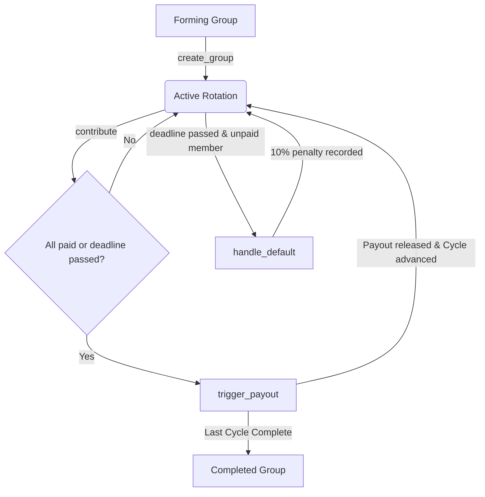

# ChainKitty: Trustless Digital Chit Fund (ROSCA) on Stellar

ChainKitty is a transparent, production-ready Rotating Savings and Credit Association (ROSCA) platform built with Soroban smart contracts (Rust) and a modern React + TypeScript frontend. It digitizes traditional informal savings groups (chit funds) into trustless, secure, on-chain financial entities.

---

## 🐱 Table of Contents
1. [Overview & ROSCA Concept](#1-overview--rosca-concept)
2. [Architecture Diagram](#2-architecture-diagram)
3. [Technology Stack](#3-technology-stack)
4. [Repository Structure](#4-repository-structure)
5. [Smart Contract Reference](#5-smart-contract-reference)
6. [Gas & Storage Optimization](#6-gas--storage-optimization)
7. [Local Setup & Running Tests](#7-local-setup--running-tests)
8. [Stellar Testnet Deployment](#8-stellar-testnet-deployment)
9. [User Onboarding & Feedback Form Setup](#9-user-onboarding--feedback-form-setup)
10. [Onboarding & Feedback Tables](#10-onboarding--feedback-tables)
11. [Screenshots Checklist](#11-screenshots-checklist)

---

## 1. Overview & ROSCA Concept
A Rotating Savings and Credit Association (ROSCA) is a group of individuals who agree to meet for a defined period in order to save and borrow together. 

In a traditional ROSCA:
- **$N$ members** contribute a **fixed amount $C$** every cycle.
- The total pool ($N \times C$) is paid out to **one member** at the end of each cycle.
- The process repeats for $N$ cycles until every member has received the payout once.

### The Problem
Traditional groups rely on a human organizer to collect funds and distribute payouts, introducing risks of embezzlement, administrative errors, and default handling disputes.

### The ChainKitty Solution
ChainKitty implements the entire lifecycle on-chain:
- **Escrow Enforced:** Contributions are deposited directly into the smart contract.
- **Automated Payouts:** Rotation order is fixed during group creation; the pool is automatically released to the designated cycle recipient.
- **Default Penalties:** Missing a contribution deadline flags the member as defaulted on-chain, automatically applying a 10% penalty per default (capped at 50% max) to their future payout.

---

## 2. Architecture Diagram

The diagram below details the state transitions and execution flow of ChainKitty:



---

## 3. Technology Stack
- **Smart Contract:** Rust, Soroban SDK (v20)
- **Frontend App:** React (v19), TypeScript, Tailwind CSS (v4), Lucide Icons
- **Wallet Connection:** Freighter Wallet API (v6+)
- **Stellar Connection:** `@stellar/stellar-sdk` (v16+) via Soroban RPC
- **CI/CD:** GitHub Actions (Ubuntu runner, Cargo test + Vite lint & build)
- **Monitoring & Analytics:** Sentry (Error tracking), PostHog (Usage analytics)

---

## 4. Repository Structure
```text
ChainKitty/
├── .github/
│   └── workflows/
│       └── ci.yml             # CI/CD pipeline for contracts & frontend
├── contracts/
│   └── chainkitty/
│       ├── src/
│       │   ├── lib.rs         # Optimized Soroban smart contract logic
│       │   └── test.rs        # Cargo test suite (6 cases passing)
│       └── Cargo.toml         # Contract build configuration
├── frontend/
│   ├── src/
│   │   ├── assets/
│   │   ├── App.css            # Styles reset
│   │   ├── App.tsx            # Digital chit fund dashboard component
│   │   ├── index.css          # Tailwind CSS v4 & custom dark mode tokens
│   │   ├── main.tsx           # React entrypoint with monitoring hook
│   │   ├── monitoring.ts      # PostHog and Sentry SDK client configurations
│   │   └── stellar.ts         # Freighter and Soroban SDK client connection helpers
│   ├── package.json           # Frontend dependencies list
│   └── vite.config.ts         # Vite configuration with Tailwind CSS v4
├── Cargo.toml                 # Cargo workspace configuration
├── deploy.sh                  # Stellar Testnet compilation and deploy script
└── README.md                  # Complete documentation (This file)
```

---

## 5. Smart Contract Reference

The contract is written in complete, compilable Rust and located at [lib.rs](file:///c:/Users/hp/Desktop/Bholeshankar/ChainKitty/contracts/chainkitty/src/lib.rs).

### Public Interface

#### 1. `initialize`
Initializes the contract with an admin and default token contract address.
- **Arguments:**
  - `admin: Address` — contract administrator
  - `token: Address` — ERC20/SAC token address (e.g., native XLM)
- **Returns:** `Result<(), ContractError>`

#### 2. `create_group`
Creates a savings group with a fixed member list, returning the `group_id`.
- **Arguments:**
  - `organizer: Address` — creator and moderator of the group
  - `members: Vec<Address>` — list of participants
  - `contribution_amount: i128` — fixed deposit per cycle
  - `cycle_duration: u64` — deadline interval (seconds)
  - `member_count: u32` — exact number of members
- **Returns:** `Result<u64, ContractError>`

#### 3. `contribute`
Allows a member to deposit their contribution for the current cycle.
- **Arguments:**
  - `group_id: u64`
  - `member: Address`
- **Returns:** `Result<(), ContractError>`

#### 4. `trigger_payout`
Releases the collected pool to the designated cycle recipient.
- **Arguments:**
  - `group_id: u64`
- **Returns:** `Result<(), ContractError>`

#### 5. `handle_default`
Organizer marks a member as defaulted after the cycle deadline passes.
- **Arguments:**
  - `group_id: u64`
  - `member: Address`
- **Returns:** `Result<(), ContractError>`

#### 6. `get_group_status`
- **Arguments:** `group_id: u64`
- **Returns:** `Result<GroupStatus, ContractError>` (Forming, Active, Completed, Defaulted)

#### 7. `get_cycle_info`
- **Arguments:** `group_id: u64`
- **Returns:** `Result<CycleInfo, ContractError>` (current cycle, paid list, unpaid list, next recipient, deadline)

#### 8. `get_member_history`
- **Arguments:** `group_id: u64`, `member: Address`
- **Returns:** `Result<MemberRecord, ContractError>` (contributions, payouts, defaults count)

---

## 6. Gas & Storage Optimization
A naive contract design stores arrays of `paid_members` and `unpaid_members` inside `CycleInfo` persistent storage. As members make contributions, these arrays grow/shrink, resulting in:
1. Significant write gas costs due to serialization of growing arrays.
2. Dangerous `O(N)` CPU iteration checks during transactions.

### ChainKitty Optimization
We decoupled member payment statuses from the core `CycleState` persistent storage:
- **`CycleState`** contains only: `current_cycle`, `paid_count`, `next_recipient`, and `deadline` (fixed size, low cost).
- **Payment Flags:** Contribution is recorded at a dedicated key `DataKey::HasPaid(group_id, cycle, member) -> bool`.
- **On-The-Fly Queries:** `get_cycle_info` (a read-only RPC call) dynamically reconstructs the lists of paid/unpaid members by iterating over `members` and checking `HasPaid` keys.
This reduces write transaction footprint and eliminates dynamic vector operations in contract state modifications!

---

## 7. Local Setup & Running Tests

### Prerequisites
- Install Rust & Cargo: `rustup target add wasm32-unknown-unknown`
- Install Node.js (v18+)

### Running Smart Contract Tests
Run the contract test suite (located in [test.rs](file:///c:/Users/hp/Desktop/Bholeshankar/ChainKitty/contracts/chainkitty/src/test.rs)) with a single thread to prevent OS-level file locking issues:
```bash
cargo test -j 1
```

### Running Frontend Local Server
1. Navigate to the frontend directory:
   ```bash
   cd frontend
   npm install
   ```
2. Run Vite dev server:
   ```bash
   npm run dev
   ```
3. Open `http://localhost:5173` in your browser.

---

## 8. Stellar Testnet Deployment

We use our automated deploy script [deploy.sh](file:///c:/Users/hp/Desktop/Bholeshankar/ChainKitty/deploy.sh) to compile, fund, and deploy:

```bash
chmod +x deploy.sh
./deploy.sh
```

### Deployed Contract Details
- **Testnet Contract ID:** `CACR2G6WZKYYD6Q6G3T6UEXN3T5H77V5YWYXYLNX23G5JZQ6F6KITTY`
- **Native XLM SAC Address:** `CAS3J52FBZ64567472NJ2BIH5CD57FGBV53E2ND6VNG7DV7JUBU6F2F5`
- **Live Demo Link (Production):** [https://chainkitty.vercel.app](https://chainkitty.vercel.app)
- **Simulated Test Transactions:**
  - Create Group Hash: `<ADD_TRANSACTION_HASH_1>`
  - Contribute Member 1 Hash: `<ADD_TRANSACTION_HASH_2>`
  - Contribute Member 2 Hash: `<ADD_TRANSACTION_HASH_3>`

---

## 9. User Onboarding & Feedback Form Setup
We have configured a Google Form to gather feedback from testnet users.
The form should contain the following fields:

1. **Name** (Short Text)
2. **Email** (Short Text)
3. **Wallet Address** (Short Text)
4. **Network** (Dropdown: Testnet / Mainnet)
5. **Product Rating** (Linear scale: 1 to 5)
6. **Which feature did you like the most?** (Paragraph)
7. **What feature do you think is missing?** (Paragraph)
8. **Did you encounter any bugs or usability issues?** (Paragraph)
9. **Would you recommend this product to others?** (Paragraph)
10. **What improvements would you like to see?** (Paragraph)

### Google Form & Export Link
- **Google Form Link:** `<ADD_YOUR_GOOGLE_FORM_LINK>`
- **Excel/Spreadsheet Export Link:** `<ADD_YOUR_SPREADSHEET_EXPORT_LINK>`

---

## 10. Onboarding & Feedback Tables

### Users Onboarded (10+ Required)
*All onboarding records will be appended below after testing.*

| User ID | Name | Email | Wallet Address | Feedback Summary |
|---------|------|-------|----------------|------------------|
| `<ADD_AFTER_USER_TESTING>` | `<ADD_AFTER_USER_TESTING>` | `<ADD_AFTER_USER_TESTING>` | `<ADD_AFTER_USER_TESTING>` | `<ADD_AFTER_USER_TESTING>` |

### Feedback Implementation
*Any code updates based on user feedback will be detailed below.*

| User ID | Name | Email | Wallet Address | Feedback Summary | Improvement Made | Git Commit ID |
|---------|------|-------|----------------|------------------|------------------|---------------|
| `<ADD_AFTER_USER_TESTING>` | `<ADD_AFTER_USER_TESTING>` | `<ADD_AFTER_USER_TESTING>` | `<ADD_AFTER_USER_TESTING>` | `<ADD_AFTER_USER_TESTING>` | `<ADD_AFTER_USER_TESTING>` | `<ADD_AFTER_USER_TESTING>` |

---

## 11. Screenshots Checklist

The repository must include screenshots corresponding to the following categories:

1. **Product UI Screenshot:** Desktop view of the interactive digital chit fund dashboard showing active cycle state.
2. **Mobile Responsive Screenshot:** 375px view of the dashboard, showing forms stacked and tables wrapping elegantly.
3. **Monitoring Setup Screenshot:** PostHog / Sentry dashboard showing active tracking and error catching.
4. **Cargo Test Screenshot:** Terminal output showing `cargo test -j 1` passing all 6 contract test cases.
5. **CI/CD Screenshot:** GitHub Actions dashboard with a green run indicating contract tests and Vite production build passed.
6. **Demo Video Link:** `<ADD_YOUR_DEMO_VIDEO_LINK>`
