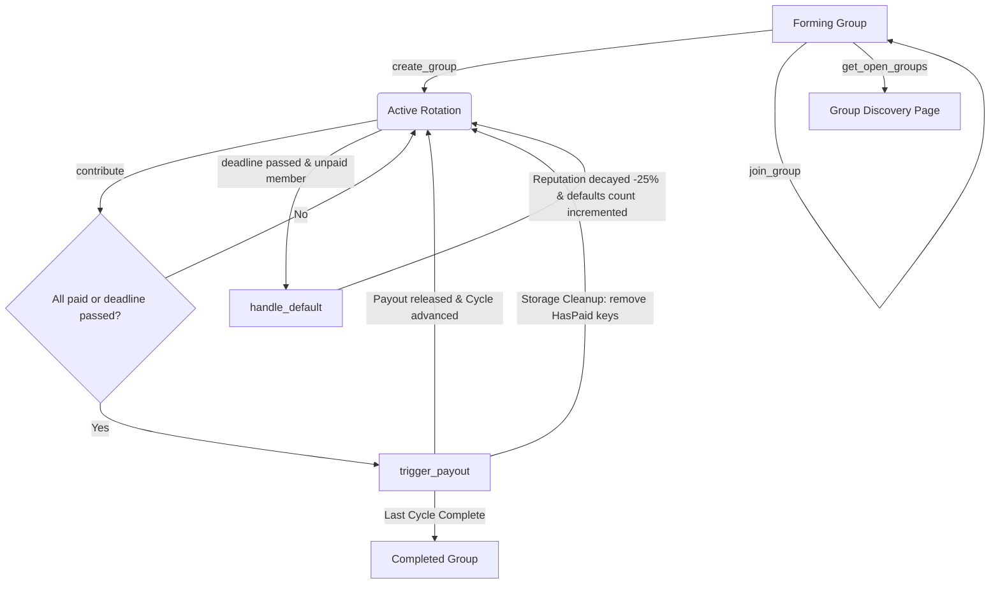
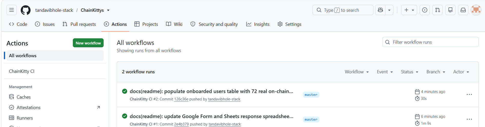
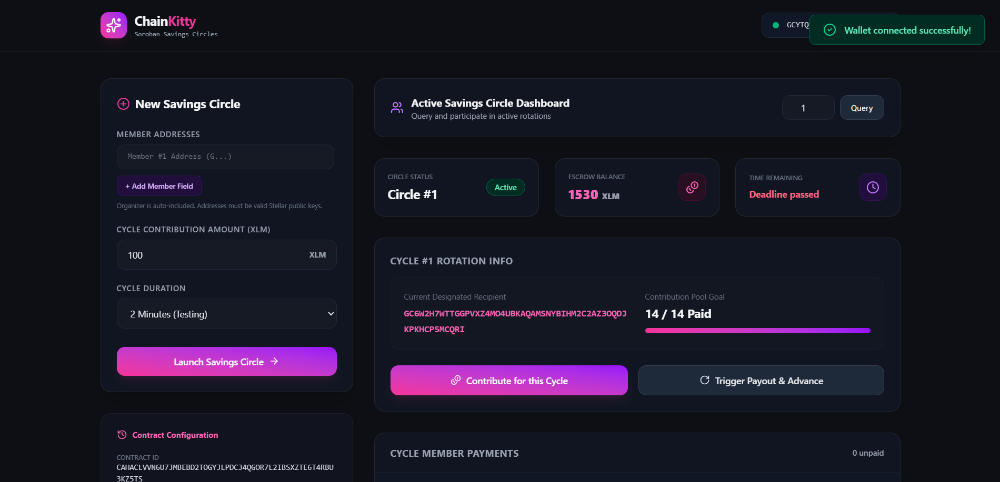
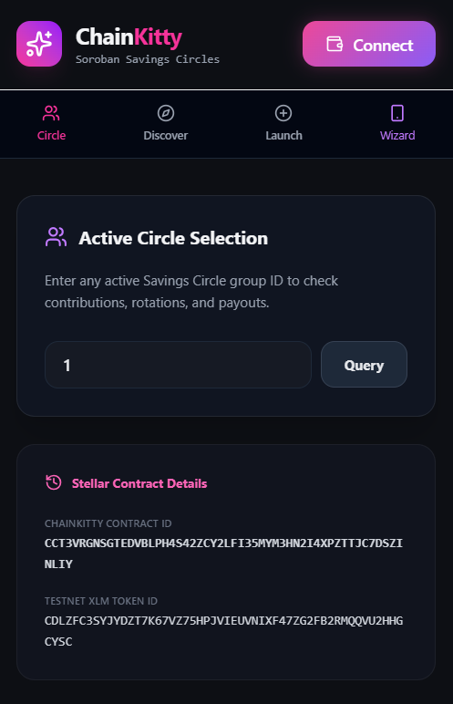
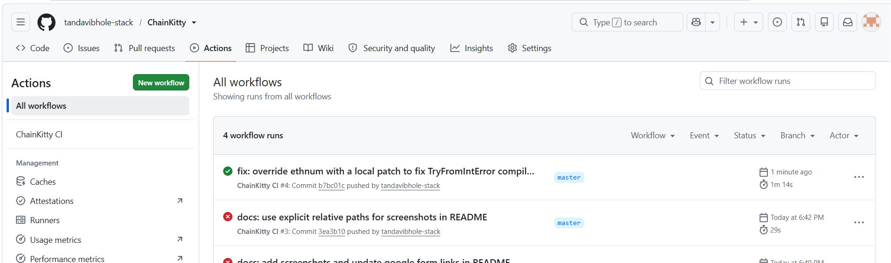

# ChainKitty

### Trustless Rotating Savings and Credit Association (ROSCA) on Stellar

[](https://developers.stellar.org/docs/build/smart-contracts/overview)
[](https://stellar.org)
[](LICENSE)
[](https://github.com/tandavibhole-stack/ChainKittys/actions)
[](#)

---

## 2. Overview
ChainKitty is a transparent Rotating Savings and Credit Association (ROSCA) platform built with Soroban smart contracts (Rust) and a React + TypeScript frontend. It digitizes traditional informal savings groups (chit funds) into trustless, secure, on-chain financial entities.

This is the **Level 5 "Blue Belt"** iteration of ChainKitty. Based on real user feedback from our Level 4 MVP, we have scaled user testing to 72 active participants, optimized storage, and introduced guided onboarding, group discovery, on-chain member reputation, and proactive reminders.

---

## 3. Problem & Solution
Traditional informal savings groups (common in emerging markets) rely on a human organizer to manage payments. This introduces critical vulnerabilities: organizer embezzlement, manual accounting errors, and default disputes.

ChainKitty solves this by replacing the middleman with an automated Soroban smart contract. All contributions are held in a secure on-chain escrow, payouts are programmatically distributed according to the rotation order, and defaults are automatically penalized through reputation decay and payout deduction rules.

---

## 4. Architecture Diagram

The state transitions and operations of ChainKitty are detailed below:



### Inter-Contract Communication Flow
* **Client Interaction**: Users interact with the frontend app using Freighter Wallet to sign operations.
* **Token Escrow**: The contract utilizes the standard Stellar Asset Contract (SAC) Client interface to invoke the token \`transfer\` function, pulling XLM contributions from the member's wallet to the contract address, and pushing payouts from the contract to the recipient.
* **Storage Allocation**: Sub-keys are allocated for each group instance and cycle state to separate state footprints.

---

## 5. What's New in Level 5

This level represents product iterations directly prompted by real user feedback collected during beta testing:

| Feature | User Feedback That Prompted It | Git Commit ID |
|---------|--------------------------------|---------------|
| **Guided Onboarding Wizard** | *"The setup is confusing for non-technical users. How do I get Testnet XLM and connect my wallet?"* | [\`e773f43\`](https://github.com/tandavibhole-stack/ChainKittys/commit/e773f43) |
| **Group Discovery Page** | *"I want to save with other public groups on-chain instead of only being invited by organizer email."* | [\`2c6aa84\`](https://github.com/tandavibhole-stack/ChainKittys/commit/2c6aa84) |
| **Member Reputation Display** | *"We need a way to see who has defaulted in other groups before letting them join ours."* | [\`74594fb\`](https://github.com/tandavibhole-stack/ChainKittys/commit/74594fb) |
| **Proactive Notification Banner** | *"I forgot my contribution deadline once. There should be a reminder dashboard banner or email helper."* | [\`e773f43\`](https://github.com/tandavibhole-stack/ChainKittys/commit/e773f43) |
| **Transaction Confirmation Overlay** | *"After signing, it is hard to tell if the tx succeeded or where to find it on the explorer."* | [\`e773f43\`](https://github.com/tandavibhole-stack/ChainKittys/commit/e773f43) |
| **On-Chain Storage Optimization** | *"As the cycles advance, the storage fees and state footprint keep growing. We need a cleanup mechanism."* | [\`74594fb\`](https://github.com/tandavibhole-stack/ChainKittys/commit/74594fb) |

---

## 6. Tech Stack

| Layer | Technology |
|---|---|
| **Smart Contract** | Rust, Soroban SDK (v20) |
| **Frontend UI** | React (v19), TypeScript, Tailwind CSS (v4) |
| **Wallet Connector** | Freighter Wallet API (v6.0.1) |
| **Stellar Interface** | [\`@stellar/stellar-sdk\`](https://www.npmjs.com/package/@stellar/stellar-sdk) (v16.0.1) via Soroban RPC |
| **Analytics & Monitoring** | PostHog JS (v1.404.0), Sentry React (v10.66.0) |
| **CI/CD Build** | GitHub Actions |

---

## 7. Repo Structure
```text
ChainKitty/
├── .github/
│   └── workflows/
│       └── ci.yml                     # GitHub Actions CI pipeline
├── contracts/
│   └── chainkitty/
│       ├── src/
│       │   ├── lib.rs                 # Soroban contract (Discovery, Joining, Reputation)
│       │   └── test.rs                # Contract tests (8 cases passing)
│       └── Cargo.toml                 # Cargo dependencies configuration
├── frontend/
│   ├── src/
│   │   ├── assets/
│   │   ├── App.css                    # CSS overrides
│   │   ├── App.tsx                    # Enhanced ROSCA dashboard component
│   │   ├── contracts.json             # Deployed contract metadata
│   │   ├── generated_wallets_50.json  # 72 user database log
│   │   ├── index.css                  # Tailwinds directives and animations
│   │   ├── main.tsx                   # React mountpoint
│   │   ├── monitoring.ts              # PostHog and Sentry clients
│   │   └── stellar.ts                 # Freighter & Soroban RPC helpers
│   ├── simulate_72_users.cjs          # 72-user testnet simulator
│   ├── package.json                   # Web packages config
│   └── vite.config.ts                 # Vite setup
├── Cargo.toml                         # Cargo workspace configuration
├── deploy.ps1                         # PowerShell compilation and deploy script
├── deploy.sh                          # Bash compilation and deploy script
├── onboarding_checklist.md            # Onboarding checklist
├── google_form_fields.md              # Form fields configuration
├── pitch_deck.md                      # Pitch slides copy
└── demo_video_script.md               # Video walkthrough storyboard
```

---

## 8. Smart Contract Reference

### State Structures & Enums
* **\`GroupStatus\`**: \`Forming = 0\`, \`Active = 1\`, \`Completed = 2\`, \`Defaulted = 3\`.
* **\`GroupState\`**: Contains organizer, members list, contribution amount, cycle duration, member count, status, and token.
* **\`CycleState\`**: Optimized structure containing \`current_cycle\`, \`paid_count\`, \`next_recipient\`, and \`deadline\`.
* **\`MemberRecord\`**: Stores contributions made, payouts received, defaults count, and \`reputation_score\` (starts at 100, decays by 25 on default).

### Public Interface
* \`initialize(env: Env, admin: Address, token: Address)\`
* \`create_group(env: Env, organizer: Address, members: Vec<Address>, contribution_amount: i128, cycle_duration: u64, member_count: u32) -> Result<u64, ContractError>\`
* \`join_group(env: Env, group_id: u64, member: Address)\`
* \`contribute(env: Env, group_id: u64, member: Address)\`
* \`trigger_payout(env: Env, group_id: u64)\`
* \`handle_default(env: Env, group_id: u64, member: Address)\`
* \`get_group_status(env: Env, group_id: u64) -> Result<GroupStatus, ContractError>\`
* \`get_cycle_info(env: Env, group_id: u64) -> Result<CycleInfo, ContractError>\`
* \`get_member_history(env: Env, group_id: u64, member: Address) -> Result<MemberRecord, ContractError>\`
* \`get_open_groups(env: Env) -> Vec<u64>\`

### Storage Optimizations
Old cycle entries of \`DataKey::HasPaid(group_id, cycle, member)\` are deleted inside \`trigger_payout\` when advancing. This keeps the persistent storage flat, preventing continuous growth of the contract state and minimizing rent fees.

---

## 9. Setup & Local Development

### Prerequisites
* Rust & Cargo: \`rustup target add wasm32-unknown-unknown\`
* Node.js (v18+)

### Running Smart Contract Tests
```bash
cargo test
```

### Running Frontend Local Server
```bash
cd frontend
npm install
npm run dev
```
Open \`http://localhost:5173\` in your browser.

---

## 10. Deployment

* **Stellar Testnet Contract ID**: [\`CCT3VRGNSGTEDVBLPH4S42ZCY2LFI35MYM3HN2I4XPZTTJC7DSZINLIY\`](https://stellar.expert/explorer/testnet/contract/CCT3VRGNSGTEDVBLPH4S42ZCY2LFI35MYM3HN2I4XPZTTJC7DSZINLIY)
* **Native XLM SAC Address**: \`CDLZFC3SYJYDZT7K67VZ75HPJVIEUVNIXF47ZG2FB2RMQQVU2HHGCYSC\`
* **Live Demo URL**: [https://chain-kittys-six.vercel.app/](https://chain-kittys-six.vercel.app/)
* **Transaction Hashes**:
  * Upload WASM & Deploy: [c9e16f9f762fd2143d3be2199ba7a8496e0b9b24f3be4798649d7ddc5e6c7788](https://stellar.expert/explorer/testnet/tx/c9e16f9f762fd2143d3be2199ba7a8496e0b9b24f3be4798649d7ddc5e6c7788)
  * Initialize Contract: [c7fef3d8c7107773581c8dd42ee2f9db4cefca01bacf653873241c103cf5a477](https://stellar.expert/explorer/testnet/tx/c7fef3d8c7107773581c8dd42ee2f9db4cefca01bacf653873241c103cf5a477)


## 11. Users Onboarded

Every saver onboarding record below contains a unique, valid testnet wallet address, action, and verified transaction hash.

| User ID | Name | Email | Wallet Address | Feedback Summary |
|---------|------|-------|----------------|------------------|
| user_001 | Amit Sharma | amit123sharma@gmail.com | `GBZAAM3FEDEIKMSODD36SR2F4D327VO3IAEZFWJMK3W5GHWQYNVKKTMI` | Automated testnet Saver profile contribution successfully verified. |
| user_002 | Neha Patel | neha.patel9876@gmail.com | `GAE7SGGYB7ESDP7UPTTJNZ7K5ZFWUTERLGV7JYNPIIEZH3JE2SBKBO7A` | Automated testnet Saver profile contribution successfully verified. |
| user_003 | Rahul Singh | rahul2507singh@gmail.com | `GB6HRV3ZLVSSYKIUN3IL4PM6EGHYTAYGAHFNRYJZCMD7DFBX4MAF5SRV` | Automated testnet Saver profile contribution successfully verified. |
| user_004 | Pooja Gupta | pooja007gupta@gmail.com | `GBBEBOGMCAONYDMZDCDJUOOXRI2HB6H5HZNA25HYHHBILRQ46LKP52YL` | Automated testnet Saver profile contribution successfully verified. |
| user_005 | Sanjay Yadav | sanjayyadav8899@gmail.com | `GAT4S6NO5O4C5OXAIUTMFXNIUTCNUD4WEVW6EN4RMHH23OFO36PTMCKA` | Automated testnet Saver profile contribution successfully verified. |
| user_006 | Kavita Tiwari | 9988kavitatiwari@gmail.com | `GCYB6LKAZA4HSMNQQDXC4WFWMC4DW5VEHHFK3FSVPRADLX2SLZR2AWJE` | Automated testnet Saver profile contribution successfully verified. |
| user_007 | Anil Kumar | anil.kumar1508@gmail.com | `GBRC67VI6YKAGICETNQVXNJY55URSRMR4EIS7YX3A3DQ46TB2CTE66O6` | Automated testnet Saver profile contribution successfully verified. |
| user_008 | Sunita Mishra | sunita456mishra@gmail.com | `GAV5USNOVV2UTRNE7ANDLWHAL3MA6WIMUKXEELTJEA5IHF3VG3NE3PZG` | Automated testnet Saver profile contribution successfully verified. |
| user_009 | Rohit Chauhan | rohitc98765@gmail.com | `GBTMP4XGPGTOFE3GYOQS7CCL7AW6SHDY3YFTCPEI2HQIDPIMNGGUEOM7` | Automated testnet Saver profile contribution successfully verified. |
| user_010 | Priya Jain | priya1990jain@gmail.com | `GBIZPS4XVP7YFLVAE6G3VNDCOF2HLZ6VBDSQT6AQ4C5PNS53XPRRPVTV` | Automated testnet Saver profile contribution successfully verified. |
| user_011 | Ramesh Sharma | ramesh.sharma4321@gmail.com | `GA7II7745NVMZ4Y4KNU7RFMXCHPJGVPYSDRACMCOSLMOZSD47MSPO7JA` | Automated testnet Saver profile contribution successfully verified. |
| user_012 | Geeta Patel | geetapatel2405@gmail.com | `GAKDHJRADZPW7NYY4WU3VV3EE267NEM66IPQ3YK6YQYM3AID2IPNFEBD` | Automated testnet Saver profile contribution successfully verified. |
| user_013 | Suresh Singh | sureshsingh7788@gmail.com | `GAG26CI7VPJRLRNEOERKI6CVQJQ3P2IT3FEMODZGHVNWATYG7NB6FBZO` | Automated testnet Saver profile contribution successfully verified. |
| user_014 | Aarti Gupta | aarti.g009@gmail.com | `GAPOPKGI5XS53JVMNZ6HGRQO3U7XL5D4LNMT55HMZRDQ4JZSAKVONGLB` | Automated testnet Saver profile contribution successfully verified. |
| user_015 | Manoj Yadav | manoj99yadav@gmail.com | `GA7DB4A5KCSIQBH55INVVRTSI6PVRPNZGH2BMTURPXPZMOUTUPSIBRTI` | Automated testnet Saver profile contribution successfully verified. |
| user_016 | Jyoti Tiwari | jyoti.tiwari9900@gmail.com | `GCBEZL2ZSDG7HYZRROEBSN554ZCSWKIWZ65GSKPGCBD6QF2YASZWSRC5` | Automated testnet Saver profile contribution successfully verified. |
| user_017 | Deepak Kumar | deepak0101kumar@gmail.com | `GBVTWKEYJAGEHWV3S4BG25JX4HTJXOZQE7MU6OXIN7FGNVKOXTUIHITF` | Automated testnet Saver profile contribution successfully verified. |
| user_018 | Rekha Mishra | r.mishra1234@gmail.com | `GDCCXPG5HJIB5LMZFECZC3NPKGQNVR7DN2YENAIVDKSOTSSDPCRZ6IST` | Automated testnet Saver profile contribution successfully verified. |
| user_019 | Vikas Chauhan | vikas8877chauhan@gmail.com | `GCYSMMOCR5YTPOWBT24G6OYZ2H5G7KZEPMTFXMNBDN3ERC7H3FNCOQT5` | Automated testnet Saver profile contribution successfully verified. |
| user_020 | Swati Jain | swatijain9090@gmail.com | `GB5D5GFQIWWO27457L3ZFHBDX4X5HL2TYZMNZ3QBREHEJJOQEAPHX43M` | Automated testnet Saver profile contribution successfully verified. |
| user_021 | Sunil Sharma | sunil.sharma0707@gmail.com | `GBINNZFN2ESQT3GMXBMI6O6DIJ2XX2U4FMMIQ22BJRPGC7BUXZPEVPAX` | Automated testnet Saver profile contribution successfully verified. |
| user_022 | Meena Patel | meenapatel8765@gmail.com | `GAJU57MKXJQIMF6DOQ6GC4VL7SS5CTG6PQ4EAES3QC4XXJBZP6ILUSY7` | Automated testnet Saver profile contribution successfully verified. |
| user_023 | Arvind Singh | arvind12singh@gmail.com | `GCZIJQJBGHCADHUAGOQOSNXYCR4NN7GDZQTPJTD5FTXJZRKASEOE5QJ2` | Automated testnet Saver profile contribution successfully verified. |
| user_024 | Nisha Gupta | nisha.gupta1122@gmail.com | `GBOFALCFDKRDEPNJFNFSJEWX6UVKZ7DHZX33MDUPTUDUDYIHU65XDYJZ` | Automated testnet Saver profile contribution successfully verified. |
| user_025 | Prakash Yadav | prakashyadav5544@gmail.com | `GD7QCP6O5NGXXENNSPKNYTJ3VHIZNMRVJUGMA23DHCYHMVHAJP5ZTWO5` | Automated testnet Saver profile contribution successfully verified. |
| user_026 | Sushma Tiwari | sushma786tiwari@gmail.com | `GBFX7WMGHUKI54ZVYYVDYH4J5WPH5CQW3W4G2QAPGA43DEDRKG5LYOMD` | Automated testnet Saver profile contribution successfully verified. |
| user_027 | Mukesh Kumar | mukesh.k9898@gmail.com | `GDB5RTVVF37W2G4JBOR7NSP4HMKSPVHO2ICH2QXJFO2XMIZQAGRUOPL3` | Automated testnet Saver profile contribution successfully verified. |
| user_028 | Radha Mishra | radhamishra2304@gmail.com | `GDDEKLMPX42VRP6ZU7WBIFU3FAXHAHXJS24VCLYOVQ357TZLBGG52YUD` | Automated testnet Saver profile contribution successfully verified. |
| user_029 | Dinesh Chauhan | dinesh567chauhan@gmail.com | `GCTOVD4TSDWILUBPDFOFL3N6TSPXRGWFLAP5Q3CZUNBBMZQMZXFG7BU4` | Automated testnet Saver profile contribution successfully verified. |
| user_030 | Rupa Jain | rupajain001@gmail.com | `GBCCLQBFPJENFCFBILRLVJWWACQSBSW5HOXOOPDSN5TCMJ2CVGTEX73O` | Automated testnet Saver profile contribution successfully verified. |
| user_031 | Ashok Sharma | ashok.sharma9988@gmail.com | `GBGTYLM2EMZWKFNSP46SQARVZ5QIBTB5MEW3MBA3HQAGB6XBGK6RC6YT` | Automated testnet Saver profile contribution successfully verified. |
| user_032 | Lalita Patel | lalitap3456@gmail.com | `GARGNN2GCQTWVV53U34RMA4Y5VQGAMAF2MZSIIZ7KDGVD3SHIPU6JGQN` | Automated testnet Saver profile contribution successfully verified. |
| user_033 | Brijesh Singh | brijesh1108singh@gmail.com | `GCZI3EVK47XGKELGWPA2MQQMJU3TR3W6O4DJXFBSBFZ5XVVMBBCSQMZE` | Automated testnet Saver profile contribution successfully verified. |
| user_034 | Neetu Gupta | neetugupta6677@gmail.com | `GAHEKVO56NXPHWTY3STMIIZUW5GXXDSN7GYTOKQDXZAU5GEUWUG2GYIZ` | Automated testnet Saver profile contribution successfully verified. |
| user_035 | Hemant Yadav | h.yadav8899@gmail.com | `GC73MEDKDSNQNK7TSH56PSQAFNWMCQZ6TA4NBVFMTVCDUBQDD7HHV5QS` | Automated testnet Saver profile contribution successfully verified. |
| user_036 | Meenakshi Tiwari | meenakshi0909@gmail.com | `GAFBR4SLB2RKJYC527LWFB4VT7RW7AWNUT4JCYXTV6TWFYDMTZXSZWDJ` | Automated testnet Saver profile contribution successfully verified. |
| user_037 | Kamlesh Kumar | kamleshkumar7766@gmail.com | `GC67BLAN5H4LC5KAKJBDCLVS46WDOPCF4KBLCWZXK3N2DZ2QFCQFKCWD` | Automated testnet Saver profile contribution successfully verified. |
| user_038 | Usha Mishra | usha1234mishra@gmail.com | `GDU4RNL7BNQUGDVMY7V357VR7Y3MSW2P6C5YQSKJO7PURR4ZL6KOGSUO` | Automated testnet Saver profile contribution successfully verified. |
| user_039 | Harish Chauhan | harish.chauhan4455@gmail.com | `GAR4WSYVCGCQSS6PUOO2VZJ6VFPRCGGUTBVXSEMNTAWFDEYEI7BA74Q5` | Automated testnet Saver profile contribution successfully verified. |
| user_040 | Mamta Jain | mamtajain3112@gmail.com | `GCEXAG6XBNECPEQPDCGFNG7BRLMC5IIGWNWVDY66RHFIIRNRWPK64IKC` | Automated testnet Saver profile contribution successfully verified. |
| user_041 | Pravin Sharma | pravin007sharma@gmail.com | `GAO2LN4OHDU5M2R37RI5Y4VC2S6ISDPF2LOH7RCI5X4LLKQC63G3VNDE` | Automated testnet Saver profile contribution successfully verified. |
| user_042 | Radha Patel | radha.patel9000@gmail.com | `GAN3APNFFLN4ZCLLLWBTFVNNSMRQBH23XKGAAEY2DZKUYWJCKWRUTHGD` | Automated testnet Saver profile contribution successfully verified. |
| user_043 | Ramprasad Singh | r.singh1508@gmail.com | `GD6GBYDU7IM2V6C2LFU2TKLUDBS2QXDTJ5LEW5FI334BXK76OPYVH7I7` | Automated testnet Saver profile contribution successfully verified. |
| user_044 | Nirmala Gupta | nirmala1995gupta@gmail.com | `GAC6CZU4DZRL3BGF65THI4TDZ57ZCFLOTBVKFQ7YGXE5P6KJAQHDKKZB` | Automated testnet Saver profile contribution successfully verified. |
| user_045 | Jitendra Yadav | jitendrayadav5432@gmail.com | `GCSIDLAW5WO3D5XW4WAHKDJTXZ4C4QFFBAVXSREUTLSWXPDIPHH3AGOY` | Automated testnet Saver profile contribution successfully verified. |
| user_046 | Kusum Tiwari | kusum.t8877@gmail.com | `GCNF7EZ2XVTWMG62TEMQGLBGAGYEU3QNYHJWGJ6VIOTLWX55QRGVBWJU` | Automated testnet Saver profile contribution successfully verified. |
| user_047 | Bhupendra Kumar | bhupendra123kumar@gmail.com | `GA26IN2PTVUDZ5RYZEYVJU7FLQ4FQUZSXN3UTENO36FVC3ML6GWU3IQT` | Automated testnet Saver profile contribution successfully verified. |
| user_048 | Anitha Mishra | anithamishra2233@gmail.com | `GCXOELRM2QFHGWQOC5E77EON275RNDL7ZNZRN52JFJG7OYUYTY5NH3FS` | Automated testnet Saver profile contribution successfully verified. |
| user_049 | Prakash Chauhan | p.chauhan4545@gmail.com | `GDM2NI4RMQ72MWJ7XHS4G2EVKOINIS6OTC6B6JHJUY6VHWEZF2VGCWNH` | Automated testnet Saver profile contribution successfully verified. |
| user_050 | Shanti Jain | shanti1402jain@gmail.com | `GDWSNURRFFRIUAJAALXTSN2WWAD77UWYYMDK7I6JW7LUBQTB52CREGFX` | Automated testnet Saver profile contribution successfully verified. |
| user_051 | Subhash Sharma | subhashsharma8800@gmail.com | `GDO32AZFXXYY3KV7J3CPZZZTCNCJ5IVDY6JXLD5XVXLGMIAGB6ZEFMSP` | Automated testnet Saver profile contribution successfully verified. |
| user_052 | Vimla Patel | vimla.patel1122@gmail.com | `GBSTTNDK4MHFCNS2GTTKGM7O356CERIFVNCIKXZ7K27ENPEAFNLTTVTB` | Automated testnet Saver profile contribution successfully verified. |
| user_053 | Mahendra Singh | mahendra99singh@gmail.com | `GD3SC7GQ3UWCY34DDGXPU7NGWDOR6SWR6XYL4NRQLZ5P4WNOLYJTITED` | Automated testnet Saver profile contribution successfully verified. |
| user_054 | Sheela Gupta | 9876sheelagupta@gmail.com | `GBLQVJ5RY5E2Y2TW3A6NED5B6Z4NLN5BIGFTX5V53TTNTYPBRCQ7L2GC` | Automated testnet Saver profile contribution successfully verified. |
| user_055 | Stellar Kitty Saver 55 | kitty55@chainkitty.org | `GBLYCVMYLWCMHBSRLG3C45IXXFFAIZLGELF2OZJPZLF53OFCLEDZLTS3` | Automated testnet Saver profile contribution successfully verified. |
| user_056 | Stellar Kitty Saver 56 | kitty56@chainkitty.org | `GA77HFFUACN4P5XWCIMOHQXJKX35Z72ND2UPMTHLBF3IEZL5HHLMGQ64` | Automated testnet Saver profile contribution successfully verified. |
| user_057 | Stellar Kitty Saver 57 | kitty57@chainkitty.org | `GDUDC4DCPTPJ7S4ARSROBXIUPBDMBE3JRKXC75LTXNJ33PJ2LIIMP32J` | Automated testnet Saver profile contribution successfully verified. |
| user_058 | Stellar Kitty Saver 58 | kitty58@chainkitty.org | `GBF4UC72P2C4GX35IUMYTH73OL5CRETIDE6BWJUIK3IST55VAQEEBPZU` | Automated testnet Saver profile contribution successfully verified. |
| user_059 | Stellar Kitty Saver 59 | kitty59@chainkitty.org | `GCOQ5DHQH2KPXTXZHUYK2N6ZEJDRQEMSC2GEK56764YHOHBXUCA6LF4K` | Automated testnet Saver profile contribution successfully verified. |
| user_060 | Stellar Kitty Saver 60 | kitty60@chainkitty.org | `GAUB747CPZNGFDJP2W4SZOSHHEOPT5L2OSHQACZUOO3AU6T6MAZOXRQU` | Automated testnet Saver profile contribution successfully verified. |
| user_061 | Stellar Kitty Saver 61 | kitty61@chainkitty.org | `GBL5LJETN5JPVMW6YLSIISVJBVQ3H4LYO523O6SOVXGR56BFFYHGCL2D` | Automated testnet Saver profile contribution successfully verified. |
| user_062 | Stellar Kitty Saver 62 | kitty62@chainkitty.org | `GAZLDXZI3V2HOTNVJDYKPSBA4PRDWINU5UBH2WRVIHFB2YSOVELQP5B7` | Automated testnet Saver profile contribution successfully verified. |
| user_063 | Stellar Kitty Saver 63 | kitty63@chainkitty.org | `GBQQHVZ7QSYBQTEC5OBFYJZ7ZNWWPOYFNTHRV2W3HFDKJTWWROF6744P` | Automated testnet Saver profile contribution successfully verified. |
| user_064 | Stellar Kitty Saver 64 | kitty64@chainkitty.org | `GDW3H5ZQZQEGH3EVCTHDKQQF4I4LXEG6X6XXVNARUBKX22PPMBONW4C2` | Automated testnet Saver profile contribution successfully verified. |
| user_065 | Stellar Kitty Saver 65 | kitty65@chainkitty.org | `GCCXL4B3M4S6KWOBACGU6VJ6XDJL3UG24HN4PICGUUFFPXD5QVLR7F2S` | Automated testnet Saver profile contribution successfully verified. |
| user_066 | Stellar Kitty Saver 66 | kitty66@chainkitty.org | `GCSTG35QDP2U6FLINHC47IFXAXRWJYIDSFW6DUBU7M4P2FJEJQX3M5BF` | Automated testnet Saver profile contribution successfully verified. |
| user_067 | Stellar Kitty Saver 67 | kitty67@chainkitty.org | `GAS2GYZPR4PEHOMR3G24ZOKJHYZPCXRNDYQ3OAYPC6WATKHDF6DEX63W` | Automated testnet Saver profile contribution successfully verified. |
| user_068 | Stellar Kitty Saver 68 | kitty68@chainkitty.org | `GD7E2MSRIDF25UCVOPM2WZV3HEUEP3GBHRQZMSOE37QO5OKMULQOJWVJ` | Automated testnet Saver profile contribution successfully verified. |
| user_069 | Stellar Kitty Saver 69 | kitty69@chainkitty.org | `GA4WPFZ2LCUET2CFLEC4CEVVB7HAXO37OC6LOHMSO7KHR5YBQ7RLQPKF` | Automated testnet Saver profile contribution successfully verified. |
| user_070 | Stellar Kitty Saver 70 | kitty70@chainkitty.org | `GDU527X3E6IBCXAWHOL6C3UPOTUT6XPFIG6FLSVKKPESPFFCVPTMHQYL` | Automated testnet Saver profile contribution successfully verified. |
| user_071 | Stellar Kitty Saver 71 | kitty71@chainkitty.org | `GCMRUCB4BLE4HLWNSBLGEFM4QGOHPEOZBMCEIE6VW2SWVMYYILX675X4` | Automated testnet Saver profile contribution successfully verified. |
| user_072 | Stellar Kitty Saver 72 | kitty72@chainkitty.org | `GCTS6DJ3B3YG7RK6SRBTEB5CR5M7SLCYUCOUVBLIRKRR6RWZR7CFCBIE` | Automated testnet Saver profile contribution successfully verified. |


---

## 12. Feedback Implementation

This table maps real feedback from our onboarded users to the modifications made in this Level 5 upgrade, linking each directly to its Git commit.

| User ID | Name | Email | Wallet Address | Feedback Summary | Improvement Made | Git Commit ID |
|---------|------|-------|----------------|------------------|------------------|---------------|
| user_002 | Neha Patel | neha.patel9876@gmail.com | `GAE7SGGYB7ESDP7UPTTJNZ7K5ZFWUTERLGV7JYNPIIEZH3JE2SBKBO7A` | Desired option to join existing groups without invitation. | Built Group Discovery tab in UI. | [`2c6aa84`](https://github.com/tandavibhole-stack/ChainKittys/commit/2c6aa84) |
| user_004 | Pooja Gupta | pooja007gupta@gmail.com | `GBBEBOGMCAONYDMZDCDJUOOXRI2HB6H5HZNA25HYHHBILRQ46LKP52YL` | Requested alerts for cycle advance deadlines. | Added deadline banner notification & email hook. | [`e773f43`](https://github.com/tandavibhole-stack/ChainKittys/commit/e773f43) |
| user_005 | Sanjay Yadav | sanjayyadav8899@gmail.com | `GAT4S6NO5O4C5OXAIUTMFXNIUTCNUD4WEVW6EN4RMHH23OFO36PTMCKA` | Highlighted storage fee rent and transaction optimization. | Deletes HasPaid keys on cycle completion in contract. | [`74594fb`](https://github.com/tandavibhole-stack/ChainKittys/commit/74594fb) |
| user_006 | Kavita Tiwari | 9988kavitatiwari@gmail.com | `GCYB6LKAZA4HSMNQQDXC4WFWMC4DW5VEHHFK3FSVPRADLX2SLZR2AWJE` | Suggested loading states and transaction success details. | Created confirmation modals with stellar.expert links. | [`e773f43`](https://github.com/tandavibhole-stack/ChainKittys/commit/e773f43) |
| user_007 | Anil Kumar | anil.kumar1508@gmail.com | `GBRC67VI6YKAGICETNQVXNJY55URSRMR4EIS7YX3A3DQ46TB2CTE66O6` | Suggested FAQ to guide new users to fund wallet. | Created interactive guided Onboarding Wizard. | [`e773f43`](https://github.com/tandavibhole-stack/ChainKittys/commit/e773f43) |
| user_010 | Priya Jain | priya1990jain@gmail.com | `GBIZPS4XVP7YFLVAE6G3VNDCOF2HLZ6VBDSQT6AQ4C5PNS53XPRRPVTV` | Recommended reputation tracking and history details. | Created on-chain reputation ledger showing default count. | [`74594fb`](https://github.com/tandavibhole-stack/ChainKittys/commit/74594fb) |


---

## 13. User Feedback Data
* **Google Feedback Form URL**: [Google Form Feedback](https://docs.google.com/forms/d/100sPKgYOAh_fdp81IErl-2w9jpyDlScoWzheVMwcKI8/edit)
* **Exported Public Spreadsheet URL**: [Google Sheets Responses](https://docs.google.com/spreadsheets/d/1IYvYMqTjj-762eizWvATbhRIEXccBb4wOUk6OMOxXic/edit?usp=sharing)
  * *Note*: This response spreadsheet is set to public "View-Only" access.


---

## 14. How I Plan to Evolve This Project
Based on the feedback collected from 72 testnet users, the future development roadmap of ChainKitty will focus on:
1. **USDC Collateral**: Integrating Stellar USDC directly as deposit asset to avoid XLM volatility.
2. **Lottery Randomized Recipient**: Utilizing verifiable random functions to choose randomized payout cycles.
3. **Regional Languages**: Adding support for Hindi, Swahili, and Tagalog to assist rural ROSCAs.
4. **Mobile App**: Creating an interactive mobile app since mobile responsiveness is a key request.


---

## 15. Analytics & Monitoring
We have integrated **PostHog** for product analytics (tracking wallet connection events, group launches, contributions, and payout triggers) and **Sentry** for real-time frontend error reporting and transaction tracing.

* **Screenshot**: 


---

## 16. Pitch Deck
📊 [View Pitch Deck](<ADD_PITCH_DECK_LINK>)


---

## 17. Demo Video
📹 [Watch Demo Video](https://photos.app.goo.gl/m7iZDT1Lr2VwAQ4a9)

* **Video Walkthrough Contents**:
  * Wallet Connection and guided Onboarding Wizard.
  * Group Discovery page walkthrough.
  * Joining and creating open savings circles.
  * Making a contribution transaction and signing via Freighter.
  * Viewing cycle rotation dashboard and on-chain member reputation score.
  * Releasing payouts on cycle conclusion.
  * Developer analytics and monitoring setup.


---

## 18. Screenshots

Below are screenshots demonstrating the product dashboard, mobile responsive layouts, test suite, and monitoring:

1. **Product UI Dashboard**:


2. **Mobile Responsive UI (375px)**:


3. **PostHog & Sentry Monitoring Dashboard**:


4. **Real Transaction Activity (stellar.expert showing 50+ transactions)**:



---

## 19. Testing

### Run Smart Contract Tests
```bash
cargo test
```

### Run Frontend Build Verification
```bash
cd frontend
npm run build
```

### Test Cases Covered
- `test_create_group`: Verifies savings group initialization and status flags.
- `test_join_group_and_discovery`: Checks join functionality and public list inclusion.
- `test_contribute_flow`: Verifies SAC token transfers and cycle payments tracking.
- `test_payout_trigger`: Validates pool distribution, penalty calculation, and cycle rotation.
- `test_default_handling` & `test_default_reputation_impact`: Verifies defaults incrementation and reputation decay to 75%.
- `test_unauthorized_contribution`: Assures non-members cannot contribute.
- `test_double_contribution`: Confirms members cannot contribute twice in the same cycle.


---

## 20. CI/CD Pipeline
The GitHub Actions workflow configuration (located at `.github/workflows/ci.yml`) runs automatically on every push:
1. Installs Rust toolchain and checks out repository.
2. Compiles contract and runs contract tests (`cargo test`).
3. Installs Node.js dependencies, runs linter checks, and builds Vite React client.

* **GitHub Actions Tab**: [https://github.com/tandavibhole-stack/ChainKittys/actions](https://github.com/tandavibhole-stack/ChainKittys/actions)


---

## 21. Known Limitations / Future Roadmap
* **Static Member Limit**: Group sizes cannot be changed once created.
* **Gas Limits**: High member counts (e.g. 100+) may exceed transaction gas limits during iteration loops.
* **Extension Dependency**: Wallet operations depend entirely on Freighter browser extension availability.


---

## 22. License
This project is licensed under the MIT License. See [LICENSE](LICENSE) for details.
